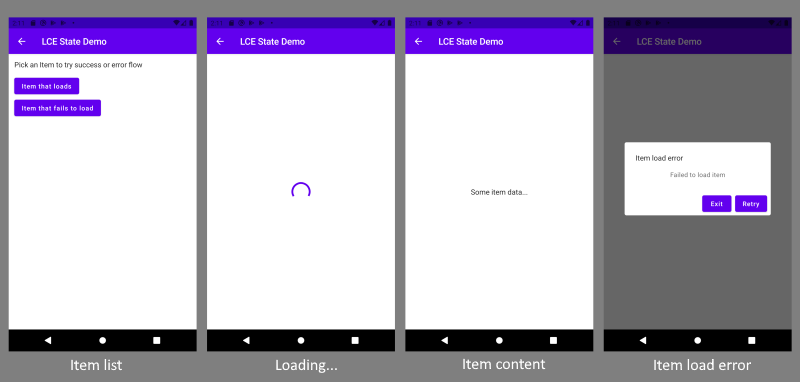
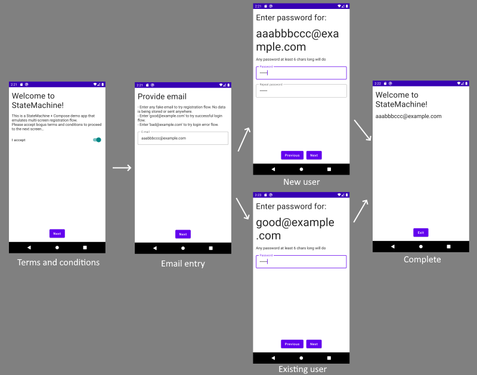
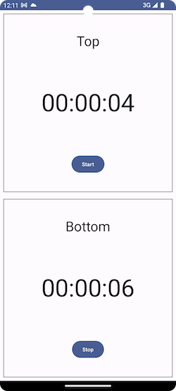

# CommonStateMachine [](https://github.com/motorro/CommonStateMachine/actions/workflows/check.yml) [](https://repo1.maven.org/maven2/com/motorro/commonstatemachine/commonstatemachine/)

Please checkout the Medium article on pattern/library usage.
- [Part I - basics](https://proandroiddev.com/mvi-architecture-with-a-state-machine-basics-721c5ebed893)
- [Part II - tools](https://proandroiddev.com/mvi-architecture-with-a-state-machine-tools-721c5ebed893-47f46413415d)
- [Part III - multi-module and multi-platform](https://proandroiddev.com/mvi-architecture-with-a-state-machine-modules-3e242666c7c)

## Contents

<!-- toc -->

- [Introduction](#introduction)
- [v3.X Breaking change](#v3x-breaking-change)
- [Dependencies](#dependencies)
- [Examples](#examples)
- [The basic task - Load-Content-Error](#the-basic-task---load-content-error)
  * [States and transitions](#states-and-transitions)
  * [State machine](#state-machine)
  * [State](#state)
  * [Implementation](#implementation)
    + [Item list state](#item-list-state)
    + [Item loading state](#item-loading-state)
    + [Item contents state](#item-contents-state)
    + [Error state](#error-state)
    + [Wiring with the application](#wiring-with-the-application)
  * [Result](#result)
- [Tools and Handy abstractions to mix-in](#tools-and-handy-abstractions-to-mix-in)
  * [Use-cases](#use-cases)
  * [View-state renderer](#view-state-renderer)
  * [State factories and dependency provision](#state-factories-and-dependency-provision)
    + [State-specific dependencies](#state-specific-dependencies)
    + [Inter-state data](#inter-state-data)
    + [Dependencies common to all states of a state-machine](#dependencies-common-to-all-states-of-a-state-machine)
    + [Common state factory](#common-state-factory)
  * [View lifecycle with `FlowStateMachine`](#view-lifecycle-with-flowstatemachine)
- [Multi-module applications](#multi-module-applications)
  * [Common API](#common-api)
  * [Module flow](#module-flow)
  * [Adopting feature-flows](#adopting-feature-flows)
    + [Gestures and view-states](#gestures-and-view-states)
    + [View implementation](#view-implementation)
    + [Adopting foreign state-flow](#adopting-foreign-state-flow)
    + [Common flow API](#common-child-flow-api)
- [Running state-machines in parallel (composition)](#running-state-machines-in-parallel-composition)
  * [MultiMachineState](#multimachinestate)
  * [ProxyMachineContainer](#proxymachinecontainer)
  * [Mapping UI states](#mapping-ui-states)
  * [Dispatching gestures](#dispatching-gestures)
  * [MachineLifecle bonus](#machinelifecle-bonus)
- [Conclusion](#conclusion)
- [Note on multiplatform](#note-on-multiplatform)

<!-- tocstop -->

## Introduction

An MVI pattern of architecting modern applications has been getting more and more popular in the 
recent time. There are a lot of articles describing the pattern but to recap let's see the key points
that make up the approach:

- **Model** - A model holds the representation of the data state and changes it with reducing logic.
  Data changes are propagated to the view layer as a stream of complete view-states.
- **View** - The view layer observes user actions and view-state changes from the model. As a result,  
  it sets the intention for the triggered UI gesture passing it to the model to process.
- **Intent** - A representation of user's gestures that changes the state of the model. View handles
  widget interactions and provides a stream of gestures to the model through the unified interface.
  
Key advantages of MVI:

- Single source of truth - one set of data and logic to define complete view-state
- Unidirectional data flow
- Thorough and complete testing of all logic with unit tests

However (as with any technology) there are some downsides that you come across along with your 
app growth:

- Too much overkill for simple functions like LCE (Load/Content/Error) display
- Too much reducer logic based on if/else of the current data state which plays badly in complex 
  multi-step scenarios.
- Quite a learning curve to grasp the technology

The simple pattern presented by this project aims to overcome the above drawbacks and to give you 
more freedom to choose technology and to build a cohesive logic and data processing in a 
"less-opinionated" way.

Key features:
- [Well-known approach](https://en.wikipedia.org/wiki/Finite-state_machine) - nothing new
- **No restriction** on your coding approach, technology stack and style
- A great way to isolate and test your logic - [low coupling and high cohesion](https://www.geeksforgeeks.org/software-engineering-coupling-and-cohesion/)
- Should work well in kotlin-multiplatform projects
- Easy to integrate with multi-module architecture
- Designed for [Jetpack Compose](https://developer.android.com/jetpack/compose) but it is not a restriction
- May (if you like to) work as a navigation library
- Explicit `Back` gesture management with the total control of yours
- Get rid of `SingleLiveEvent` for navigation, dialogs and even side-effects like toasts if you 
  like to by completely describing the current UI state.

## v3.X Breaking change

To be able to get the current UI state of the state-machine and to get rid of inconsistency of the 
UI state is not yet defined (no updates of UI state happened) the `FlowStateMachine` and 
the `ProxyMachineState` now require to pass initial UI state in constructors. 

## Dependencies

The project has a very simple core to implement yourself but you could also grab the latest core
version like that:

```groovy
dependencies {
    // Base state-machine components
    implementation "com.motorro.commonstatemachine:commonstatemachine:x.x.x"
    // Coroutine extensions (optional)
    implementation "com.motorro.commonstatemachine:coroutines:x.x.x"
}
```

Multiplatform:

```kotlin
val commonMain by getting {
    dependencies {
      // Base state-machine components
      implementation("com.motorro.commonstatemachine:commonstatemachine:x.x.x")
      // Coroutine extensions (optional)
      implementation("com.motorro.commonstatemachine:coroutines:x.x.x")
    }
}
```

## Examples

- [LCE](examples/lce) - basic example of Load-Content-Error application
- [Welcome](examples/welcome/welcome) - multi-module example of user on-boarding flow
- [Parallel](examples/multi/parallel) - two machines running in parallel in one proxy state
- [Navbar](examples/multi/navbar) - several machines running in proxy state, one of them active at a time
- [Mixed](examples/multi/mixed) - two machines of different gesture/UI system mixed in one state
- [Lifecycle](examples/lifecycle) - track your Android app lifecycle to pause pending operations when the app is suspended
- [DI](examples/di) - late child flow binding, allows for a dynamic module ([read more](#common-child-flow-api))
- [Contacts](https://github.com/Android-Developer-Basic/Contacts) - more or less real world KMP/CMP application with network and database

## The basic task - Load-Content-Error

Let's start with a basic example. Imagine we need to implement the classic master-detail view of
items with the following screen flow:


Let's break down business requirements...

We have four application _logical_ states which correspond to _screen_ states for this application:

- Item list - the list of items to load is displayed. User clicks an item to load it's contents.
- Loading item - the network operation is running. User waits for operation to complete.
- Item content - the loaded item content is displayed. User may return back to item list.
- Item load error - the load operation has failed and we have a choice to retry load or to quit the 
  application.  

### States and transitions

The state diagram with the corresponding transitions will be the following:


The diagram above, as you can see, has two types of `inter-state` transitions:

-  Red - user Intentions: clicks, 
  swipes and other interactive `Gestures` that are originated by application user.
-  Blue - transitions made by application
  logic: content display, errors, etc.

Each logical state may transition to another logical state as a result of `Gesture` or state's internal
logic.

Let's take a look at which `Gestures` each logical state processes and how they transition 
logical states:


| Logical state        | Ui-State  | Gesture/Event | Next state | Output                           |
| -------------------- | --------- | ------------- | ---------- | -------------------------------- |
| ItemList             | ItemList  | Back          | Terminated | Finishes activity                |
|                      |           | ItemClicked   | Loading    | Loads requested item             |
| Loading              | Loading   | Back          | Item list  | Cancels load and returns to list |
|                      |           | onContent     | Content    | Displays loaded item             | 
|                      |           | onError       | Error      | Displays load error              |
| Content              | Item      | Back          | Item list  | Returns to the item list         |
| Error                | Error     | Back          | Item list  | Returns to the item list         |
|                      |           | Retry         | Loading    | Retries load operation           |
|                      |           | Exit          | Terminated | Finishes activity                |

Each logical state should be able to:

- Update `UiState`
- Process some **relevant** user interactions - `Gestures` ignoring irrelevant
- Hold some internal data state
- Transition to another logical state passing some of the shared data between

Logical state may be implemented as a self-contained controller having an input, output and 
internal data and a set of rules to process gestures, to reduce data and to pass it to the next 
state when logic falls behind what's relevant for this state.

### State machine

First of all we need some kind of a bridge between the current logical state and the outside world.
The [state machine](commonstatemachine/src/commonMain/kotlin/com/motorro/commonstatemachine/CommonStateMachine.kt)
should be able to:

- Hold the active logical state
- Transition between states
- Delegate gesture processing to the current state
- Propagate UI-state changes to the outside world
- Clean-up all resources on shutdown


Methods:

- `process(gesture: G)` - Called by view upon user action. Delegated to current state.
- `clear()` - Called by view/framework to cleanup resources. Like in `onCleared` of `ViewModel`.
- `setMachineState(machineState: CommonMachineState<G, U>)`- Called by active state to transition 
  to the new one.
- `setUiState(uiState: U)` - Called by active state to update view.

The concrete state machine implementation provides a way to update the view with a new UI state.
For example the [FlowStateMachine](coroutines/src/commonMain/kotlin/com/motorro/commonstatemachine/coroutines/FlowStateMachine.kt)
exports UI state changes through `uiState` shared flow:

```kotlin
open class FlowStateMachine<G: Any, U: Any>(
  initialUiState: U,
  init: () -> CommonMachineState<G, U>
) : CommonStateMachine.Base<G, U>(init) {
  
  private val mediator = MutableStateFlow<U>(initialUiState)

  /**
   * ExportedUI state
   */
  val uiState: StateFlow<U> = mediator

  /**
   * Current UI state
   * @return current UI state or `null` if not yet available
   */
  override fun getUiState(): U = mediator.value

  /**
   * Subscription count to allow special actions on view connect/disconnect
   */
  val subscriptionCount: StateFlow<Int> = mediator.subscriptionCount

  final override fun setUiState(uiState: U) {
    mediator.tryEmit(uiState)
  }
}
```

### State

The base state class has three interaction methods:

- `doProcess(gesture: G)` - Called by the state-machine to process gesture.
- `setUiState(uiState: U)` - Call from within your state implementation to update UI State.
- `setMachineState(machineState: CommonMachineState<G, U>)` - Call from implementation to transition
  to the new state

and two lifecycle methods:

- `doStart()` - Called by the state-machine when your state becomes active. 
- `doClear()` - Called by the state machine when your current state is about to be destroyed either
  by replacing by the new state or when state-machine is about to be destroyed.

The state lives between `doStart` and `doClear` calls. You could safely call interaction methods
and expect gesture processing calls within that period. Make sure to cleanup all your pending
operations in `doClear` handler. For example, the [CoroutineState](coroutines/src/commonMain/kotlin/com/motorro/commonstatemachine/coroutines/CoroutineState.kt)
provides you the `stateScope` coroutine scope that is being cancelled in `doClear`:

```kotlin
abstract class CoroutineState<G: Any, U: Any>: CommonMachineState<G, U>() {
  protected val stateScope = CoroutineScope(SupervisorJob() + Dispatchers.Main.immediate)

  override fun doClear() {
    stateScope.cancel()
  }
}
```

### Implementation

Let's implement our application now. For this simple example we will skip some handy abstractions 
like `state-factory`, `context` and `renderer` that help you to build your states and separate 
concerns. Will talk about it later.

#### Item list state

[ItemListState](examples/lce/src/main/java/com/motorro/statemachine/lce/model/state/ItemListState.kt) is a 
starting state for our application. It displays the list of items to load. The list is hardcoded for
this example so we just emit a complete view-state when started:

```kotlin
private val items = listOf(
  ItemId.LOADS_CONTENT to "Item that loads",
  ItemId.FAILS_WITH_ERROR to "Item that fails to load"
)

override fun doStart() {
    setUiState(LceUiState.ItemList(items.map { ItemModel(it.first, it.second) }))
}
```

Handle relevant gestures by transitioning the state-machine to the newly created states.
The `LoadingState` constructor accepts an id of item to load as an inter-state common data.

```kotlin
override fun doProcess(gesture: LceGesture) = when(gesture) {
    is LceGesture.ItemClicked -> onItemClicked(gesture.id)
    is LceGesture.Back -> onBack()
    else -> super.doProcess(gesture)
}

private fun onItemClicked(id: ItemId) {
    setMachineState(LoadingState(id))
}

private fun onBack() {
    setMachineState(TerminatedState())
}
```

#### Item loading state

[LoadingState](examples/lce/src/main/java/com/motorro/statemachine/lce/model/state/LoadingState.kt) emulates 
an asynchronous operation:

```kotlin
override fun doStart() {
    setUiState(LceUiState.Loading)
    load()
}

private fun load() {
    stateScope.launch(Dispatchers.Default) {
        // Run a request in a state-bound scope
        // ...
        withContext(Dispatchers.Main) {
            // Handle result 
        }
    }
}
```

Depending on the item we pass the state transitions to either a `ContentState` or an `ErrorState`
passing either the mock content or the error occurred as an inter-state data:

```kotlin
private fun toContent() {
    setMachineState(ContentState("Some item data..."))
}

private fun toError() {
    setMachineState(ErrorState(id, IOException("Failed to load item")))
}
```

#### Item contents state

[ContentState](examples/lce/src/main/java/com/motorro/statemachine/lce/model/state/ContentState.kt) is very
simple. It just sets the UI state to display data passed to the constructor and handles a `Back` 
gesture to return to the item list:

```kotlin
override fun doStart() { 
    setUiState(LceUiState.Item(contents))
}

override fun doProcess(gesture: LceGesture) = when (gesture) {
  LceGesture.Back -> onBack()
  else -> super.doProcess(gesture)
}

private fun onBack() {
  setMachineState(ItemListState())
}
```

#### Error state
The [ErrorState](examples/lce/src/main/java/com/motorro/statemachine/lce/model/state/ErrorState.kt) gives a
user the ability to retry item load or to exit the app. Also it handles `Back` gesture to return to
the item list. Handling all user interactions through your state machine gives you a precise control
on what happens next. The item ID passed in the constructor as an inter-state data makes it possible
to preserve user's selection and to restart loading from scratch.

```kotlin
// Inter-state data:
// - failed - an ID of item failed to load
// - error - the error to display
class ErrorState(private val failed: ItemId, private val error: Throwable) : LceLogicalState() {

  override fun doStart() {
    // Display error...   
    setUiState(LceUiState.Error(error))
  }

  override fun doProcess(gesture: LceGesture) = when (gesture) {
    LceGesture.Back -> onBack()
    LceGesture.Retry -> onRetry()
    LceGesture.Exit -> onExit()
    else -> super.doProcess(gesture)
  }

  private fun onRetry() {
    // Pass the failed item ID to the loading state to initialize it
    setMachineState(LoadingState(failed))
  }

  private fun onBack() {
    setMachineState(ItemListState())
  }

  private fun onExit() {
    setMachineState(TerminatedState())
  }
}
```

#### Wiring with the application

Now that we have all states in place let's connect them together with a state machine. We need some
place to retain a machine through the application flow so let's wrap it to the [Jetpack ViewModel](examples/lce/src/main/java/com/motorro/statemachine/lce/model/LceViewModel.kt) 
which is common now:

```kotlin
class LceViewModel : ViewModel() {
    /**
     * Creates initial state for state-machine
     * You could process a deep-link here or restore from a saved state
     */
    private fun initStateMachine(): CommonMachineState<LceGesture, LceUiState> = ItemListState()

    /**
     * State-machine instance
     */
    private val stateMachine = FlowStateMachine(::initStateMachine)

    /**
     * UI State to export
     */
    val state: StateFlow<LceUiState> = stateMachine.uiState

    /**
     * Delegates gesture processing to the state-machine and the active state
     */
    fun process(gesture: LceGesture) {
        stateMachine.process(gesture)
    }

    /**
     * Runs when ViewModel is about to be destroyed
     */
    override fun onCleared() {
        stateMachine.clear()
    }
}
```

All we need to do here is:

- to create a state-machine instance
- to figure out the initial state that machine will start from
- to wire ui-state and gesture processing with the outside world

And here is an abstract of the [view](examples/lce/src/main/java/com/motorro/statemachine/lce/ui/LceScreen.kt) 
that interacts with the model:

```kotlin
@Composable
fun LceScreen(onExit: @Composable () -> Unit) {
  val model: LceViewModel = viewModel()
  val state = model.state.collectAsState(LceUiState.Loading)

  // Process back gestures with a model
  BackHandler(onBack = { model.process(Back) })

  when (val uiState = state.value) {
    LceUiState.Loading -> Loading()
    
    is LceUiState.ItemList -> ItemList(
      state = uiState,
      onItemClicked = { model.process(ItemClicked(it)) }
    )
    
    is LceUiState.Error -> LoadError(
      state = uiState,
      onRetry = { model.process(Retry) },
      onBack = { model.process(Back) },
      onExit = { model.process(Exit) }
    )
    
    is LceUiState.Item -> ItemDetails(state = uiState)
    
    LceUiState.Terminated -> onExit()
  }
}
```

Compose library plays greatly here but you could easily adapt a fragment transaction or a 
recycler view architecture as well.

### Result

As you can see the state-machine pattern may be a good choice in implementing your MVI architecture.
It produces a clean and easy to grasp step-by-step logic with well-separated concerns and easy and
[thorough](examples/lce/src/test/java/com/motorro/statemachine/lce/model/state) testing. The pattern also 
attempts to be as non-opinionated as possible. Each state is a black-box with a defined contract and
developers may choose the most suitable tools to implement each one without affecting the other. The
example above is a very basic one. However you could do things a bit more clean by using some of the 
additional abstractions (see below).

## Tools and Handy abstractions to mix-in

In the basic example above all the work was done by the state objects. They did:

- running a "network operation"
- view-state data rendering
- next state creation

That is a quite a huge responsibility which might not be so good in terms of coupling and testing.
So let's introduce some abstractions that will lift the burden off the state's shoulders.

### Use-cases

By use-case I assume any business logic external to your view logic implemented in a state. Be it 
some network operation or some other "use-case" - provide it to your state and use them as you like.
There is nothing new here - I'm sure you already use the approach in your flavour of 
Clean Architecture or similar. Example of using an external use-case could be found in 
[examples/welcome/welcome example](examples/welcome/login/src/main/java/com/motorro/statemachine/login/model/state/CredentialsCheckState.kt):

```kotlin
class CredentialsCheckState(private val checkCredentials: CheckCredentials) {

    // State logic
    
    override fun doStart() {
        stateScope.launch {
            // Runs use-case 
            val valid = checkCredentials()
        }
    }
}
```

**Note on threading:** the library doesn't provide any threading support and not thread-safe. So it
is your responsibility to implement correct thread handling so all state changes happen on 
the desired thread. 
[CoroutineState](coroutines/src/commonMain/kotlin/com/motorro/commonstatemachine/coroutines/CoroutineState.kt)
creates it's scope with `Dispatchers.Main.immediate`.

### View-state renderer

Preparing the complex view-state from your state data might be a non-trivial task in applications
with complex interface. Moving a coupling to the view-state and data structures from your state logic
might be a good idea. Testing the exact view-state creation would be much easier if you make it 
as more or less a clean function. Also your logic states may share the same rendering logic so 
externalizing it would play greatly in terms of code reuse. For example the same view-state 
rendering is used by [PasswordEntryState](examples/welcome/login/src/main/java/com/motorro/statemachine/login/model/state/PasswordEntryState.kt)
and [ErrorState](examples/welcome/login/src/main/java/com/motorro/statemachine/login/model/state/ErrorState.kt) of 
examples/welcome/welcome example. You could inject your renderer in a state factory or get it from common context
(see below).

### State factories and dependency provision

Creating new states explicitly to pass them to the state-machine later (like in the basic example)
is not a good idea in terms of coupling and dependency provision. 

The machine state, when created, may require three main classes of dependencies:

- State-specific dependencies like use-cases state operates.
- Inter-state data e.g. data loaded in a previous state, common data state, etc.
- Common dependencies for all states in machine: renderers, resource providers, factories

You are free to choose the way to provide dependencies however let's take a look at the approach
that I came to while using the state-machine pattern.

#### State-specific dependencies

To provide dependencies that are specific to each particular state I go with dedicated state 
factories that are injected with your DI framework. Let's take an [example above](#use-cases) and
extend it with a state-factory:

```kotlin
class CredentialsCheckState(private val checkCredentials: CheckCredentials) {

     // State logic

    /**
     * Dedicated state factory
     */
    @LoginScope
    class Factory @Inject constructor(private val checkCredentials: CheckCredentials) {
        operator fun invoke(): LoginState = CredentialsCheckState(
            checkCredentials
        )
    }
}
```

#### Inter-state data

By inter-state data I assume any dynamic data that is passed between states. It may be a product of
some calculation, user-generated data, etc. The most obvious way is providing it through the state 
constructor:

```kotlin
class CredentialsCheckState(
    private data: LoginDataState,
    private val checkCredentials: CheckCredentials
) {

    /**
     * Should have valid email at this point
     */
    private val email = requireNotNull(data.commonData.email) {
        "Email is not provided"
    }

    /**
     * Should have valid password at this point
     */
    private val password = requireNotNull(data.password) {
        "Password is not provided"
    }
}
```

#### Dependencies common to all states of a state-machine

Common dependencies may include renderers, state factories, common external interfaces and anything
else that is required by all states that make up the state-machine. For convenience and to save the
number of constructor params I suggest to bind them to some common interface and provide it as a 
whole. Let's name it a common [Context](examples/welcome/login/src/main/java/com/motorro/statemachine/login/model/state/LoginContext.kt):

```kotlin
interface LoginContext {
    /**
     * Common state factory (see below)
     */
    val factory: LoginStateFactory

    /**
     * External interface
     */
    val host: WelcomeFeatureHost

    /**
     * UI-state renderer
     */
    val renderer: LoginRenderer
}
```

Then you could provide it to your state through the constructor parameters. To make things even
easier let's make some [base state](examples/welcome/login/src/main/java/com/motorro/statemachine/login/model/state/LoginState.kt)
for the state-machine assembly and use a delegation to provide each context dependency:

```kotlin
abstract class LoginState(
    context: LoginContext
): CoroutineState<LoginGesture, LoginUiState>(), LoginContext by context {

    override fun doProcess(gesture: LoginGesture) {
        Timber.w("Unsupported gesture: %s", gesture)
    }
}
```

Thus every sub-class of the `LoginState` has any context dependency at hand by getting it from the 
corresponding property as if the were provided explicitly:

```kotlin
class CredentialsCheckState(
    context: LoginContext,
    private val data: LoginDataState,
    private val checkCredentials: CheckCredentials
) : LoginState(context) {

    override fun doStart() {
        // Use a context-provided dependency
        setUiState(renderer.renderLoading(data))
    }

    /**
     * Factory updated to pass common context 
     */
    @LoginScope
    class Factory @Inject constructor(private val checkCredentials: CheckCredentials) {
        operator fun invoke(
            context: LoginContext,
            data: LoginDataState
        ): LoginState = CredentialsCheckState(
            context,
            data,
            checkCredentials
        )
    }
}
```

#### Common state factory

As I've already mentioned, creating new states explicitly to pass them to the state-machine later 
(like in the basic example) is not a good idea in terms of coupling and dependency provision.

Let's move it away from our machine states by introducing a common [factory interface](examples/welcome/login/src/main/java/com/motorro/statemachine/login/model/state/LoginStateFactory.kt)
that will take the responsibility to provide dependencies and abstract our state creation logic:

```kotlin
interface LoginStateFactory {
  /**
   * Enter existing user password
   * @param data Login data state
   */
  fun passwordEntry(data: LoginDataState): LoginState

  /**
   * Checks email/password
   * @param data Data state
   */
  fun checking(data: LoginDataState): LoginState

  /**
   * Password error screen
   */
  fun error(data: LoginDataState, error: Throwable): LoginState
}
```

Each factory method here will accept **only** the inter-state data providing both context and 
state-specific dependencies implicitly. This will decouple state logic from the concrete 
implementations and increase our [testability](examples/welcome/login/src/test/java/com/motorro/statemachine/login/model/state/BaseStateTest.kt)
greatly. 

The exact factory implementation that binds together all data and dependencies will look like that:

```kotlin
@LoginScope
class LoginStateFactoryImpl @Inject constructor(
    host: WelcomeFeatureHost, // External interface
    renderer: LoginRenderer, // Renderer
    private val createCredentialsCheck: CredentialsCheckState.Factory // Concrete state factory
) : LoginStateFactory {

    // Dependencies common for each state provided through the context
    private val context: LoginContext = object : LoginContext {
        override val factory: LoginStateFactory = this@Impl
        override val host: WelcomeFeatureHost = host
        override val renderer: LoginRenderer = renderer
    }

    override fun passwordEntry(data: LoginDataState): LoginState {
        // Create explicitly
        return PasswordEntryState(context, data) 
    }

    override fun checking(data: LoginDataState): LoginState {
        // Use provided state-factory
        return createCredentialsCheck(context, data)
    }

    override fun error(data: LoginDataState, error: Throwable): LoginState {
        // Create explicitly
        return ErrorState(context, data, error)
    }
}
```

The factory is made available to your machine states through the common context:
```kotlin
class CredentialsCheckState(context: LoginContext) : LoginState(context) {
    
    // State logic...
  
    /**
     * A part of [process] template to process UI gesture
     */
    override fun doProcess(gesture: LoginGesture) = when(gesture) {
        LoginGesture.Back -> onBack()
        else -> super.doProcess(gesture)
    }

    private fun onBack() {
        // Use provided factory to create a new state
        setMachineState(factory.passwordEntry(data))
    }
}
```

Then we could mock the factory in our tests and check state transitions:

```kotlin
class CredentialsCheckStateTest {
    private val data = LoginDataState()
    private val factory: LoginStateFactory = mockk()
    private val passwordEntry: LoginState = mockk()

    @Test
    fun returnsToPasswordEntryOnBack() = runTest {
      every { factory.passwordEntry(any()) } returns passwordEntry

      state.start(stateMachine)
      state.process(LoginGesture.Back)

      verify { stateMachine.setMachineState(passwordEntry) }
      verify { factory.passwordEntry(data) }
    }
}
```

We can also provide the state factory to the `ViewModel` and use it to initialize our state-machine:

```kotlin
@HiltViewModel
class LoginViewModel @Inject constructor(private val factory: LoginStateFactory) : ViewModel() {

    /**
     * Creates initializing state
     */
    private fun initializeStateMachine(): CommonMachineState<WelcomeGesture, WelcomeUiState> {
        // Obtain data required to start from a saved-state handle or injection
        val commonData: LoginDataState = LoginDataState()
        return factory.passwordEntry(commonData)
    }    
  
    /**
     * State machine
     */
    private val stateMachine = FlowStateMachine(::initializeStateMachine)
}

```

### View lifecycle with `FlowStateMachine`

Imaging we have a resource-consuming operation, like location tracking, running in our state. It may 
save client's resources if we choose to pause tracking when the view is inactive - app goes to
background or the Android activity is paused. In that case I suggest to create some special gestures
and pass them to state-machine for processing. For example, the [FlowStateMachine](coroutines/src/commonMain/kotlin/com/motorro/commonstatemachine/coroutines/FlowStateMachine.kt) 
exports the `uiStateSubscriptionCount` property that is a flow of number of subscribers listening to
the `uiState` property. If you use some [repeatOnLifecycle](https://developer.android.com/reference/kotlin/androidx/lifecycle/package-summary#(androidx.lifecycle.Lifecycle).repeatOnLifecycle(androidx.lifecycle.Lifecycle.State,kotlin.coroutines.SuspendFunction1))
to subscribe `uiState`, you could use this property to figure out some special processing. For 
convenience there is an `mapUiSubscriptions` extension function available to reduces boilerplate.
It accepts two gesture-producing functions and updates the state-machine with them when subscriber's
state changes:

```kotlin
class WithIdleViewModel : ViewModel() {
    /**
     * Creates initial state for state-machine
     * You could process a deep-link here or restore from a saved state
     */
    private fun initStateMachine(): CommonMachineState<SomeGesture, SomeUiState> = InitialState()

    /**
     * State-machine instance
     */
    private val stateMachine = FlowStateMachine(Loading, ::initStateMachine)

    /**
     * UI State
     */
    val state: StateFlow<SomeUiState> = stateMachine.uiState

    init {
        // Subscribes to active subscribers count and updates state machine with corresponding
        // gestures
        stateMachine.mapUiSubscriptions(
          viewModelScope,
          onActive = { SomeGesture.OnActive },
          onInactive = { SomeGesture.OnInactive }
        )
    }
}
```

## Multi-module applications

Let's take a more complicated example with a multi-screen flow like the [customer on-boarding](examples/welcome/welcome).

The user is required to accept terms and conditions and to enter his email. Then the logic checks if 
he is already registered or a new customer and runs the appropriate flow to login or to register 
a user. Imagine we want the login flow and the registration flow to be in separate modules to split 
the work between teams. The state diagram would be the following:


The project uses the following modules:

* **examples/welcome/welcome** - common flow: preloading, email entry, customer check, complete
* **commoncore** - common abstractions to build application: dispatchers, resources, etc. 
* **commonapi** - common multi-platform module to connect the main app with modules
* **login** - login flow
* **commonregister** - multi-platform registration logic
* **register** - android view module for registration (separate because I've failed to implemented 
  it in android source of `commonregister` due to some multiplatform misconfiguration)

### Common API

As you could see in the diagram above each `login` and `commonregister` start after the email is 
checked and the answer to user's registration status is obtained. The module flow starts from
password entry screen though a bit different. Each module flow returns to the main flow either:

- when flow completes succefully - transfers to `Complete`
- when user hits `Back` - transfers back to email entry

Let's define the main flow interaction [API](examples/welcome/commonapi/src/commonMain/kotlin/com/motorro/statemachine/commonapi/welcome/model/state/WelcomeFeatureHost.kt)
then:
```kotlin
interface WelcomeFeatureHost {
    /**
     * Returns user to email entry screen
     * @param data Common registration state data
     */
    fun backToEmailEntry()

    /**
     * Authentication complete
     */
    fun complete()
}
```

We then place the definition to the module available to all modules: `commonapi` and provide the 
interface through the common state context like this:
```kotlin
interface LoginContext {
    /**
     * Flow host
     */
    val host: WelcomeFeatureHost

    // Other dependencies...
}
```

### Module flow

Each module has it's own sealed system of gesture/view-states:

| Module name    | Gestures        | UI-states         |
| -------------- | --------------- | ----------------- |
| welcome        | WelcomeGesture  | WelcomeUiState    |
| login          | LoginGesture    | LoginUiState      |
| commonregister | RegisterGesture | RegisterUiState   |

Each module is completely independent in terms of gestures and UI states, and we also have a 
proprietary set of 'handy abstractions' for each module: renderers, factories, use-cases, etc. 
See the source code for more details. Now that we have all module-flows designed and tested we need 
to find a way to connect completely heterogeneous systems to a single flow.

### Adopting feature-flows

Given that gesture and view system are bound to state-machine through generics we need to build  
some adapters to be able to run the flow within the main application state-flow. Things to do:

- Adapt gestures so they are plugged-in to the `welcome` gesture flow.
- Adapt view-states so the view-system could display them.
- Somehow run the alien state-flow within the `welcome` state-machine.

#### Gestures and view-states

To adopt feature-module gestures there are at least two solutions:

1. Get rid of sealed systems and inherit the common-api base marker interface for all gestures and
   view-states. Though simple, the solution is not ideal as we lose the type-safe `when` exhaustive 
   checks when we dispatch gestures in our states. So let's drop it...
2. Make a wrapping adapter that wraps the foreign gesture/view-state and unwrap it later when 
   passing them to concrete implementation. Thus we don't loose compiler support and type-safety.
   Let's follow this route

Gesture [adapter](examples/welcome/welcome/src/main/java/com/motorro/statemachine/welcome/data/WelcomeGesture.kt):
```kotlin
sealed class WelcomeGesture {
    // Native gestures...

    /**
     * Login flow gesture
     * @property value Login flow gesture
     */
    data class Login(val value: LoginGesture) : WelcomeGesture()

    /**
     * Register flow gesture
     * @property value Register flow gesture
     */
    data class Register(val value: RegisterGesture) : WelcomeGesture()
}
```

UI-state [adapter](examples/welcome/welcome/src/main/java/com/motorro/statemachine/welcome/data/WelcomeUiState.kt):
```kotlin
sealed class WelcomeUiState {
    /**
     * Login state wrapper
     * @property value Login UI state
     */
    data class Login(val value: LoginUiState) : WelcomeUiState()

    /**
     * Register state wrapper
     * @property value Register UI state
     */
    data class Register(val value: RegisterUiState) : WelcomeUiState()
}
```

#### View implementation

Now let's build feature and host composables to take advantage of our adapters. 

Feature [master-view](examples/welcome/login/src/main/java/com/motorro/statemachine/login/view/LoginScreen.kt):
```kotlin
@Composable
fun LoginScreen(state: LoginUiState, onGesture: (LoginGesture) -> Unit) {
    // Login screen rendering...
}

@Composable
fun RegistrationScreen(state: RegisterUiState, onGesture: (RegisterGesture) -> Unit) {
  // Registration screen rendering...
}
```

Application [master-view](examples/welcome/welcome/src/main/java/com/motorro/statemachine/welcome/view/WelcomeScreen.kt):
```kotlin
fun WelcomeScreen(onTerminate: @Composable () -> Unit) {
    val model = hiltViewModel<WelcomeViewModel>()
    val state = model.state.collectAsState(WelcomeUiState.Loading)

    BackHandler(onBack = { model.process(Back) })

    when (val uiState = state.value) {
        
        // Native ui-state rendering...

        // Render login screens
        is WelcomeUiState.Login -> LoginScreen(
            state = uiState.value,
            onGesture = { model.process(Login(it)) }
        )
      
        // Render registration screens      
        is WelcomeUiState.Register -> RegistrationScreen(
            state = uiState.value,
            onGesture = { model.process(Register(it))}
        )
    }
}
```

To sum-up:

1. We delegate rendering of ui-states to feature composables by unwrapping proprietary states from
   common view-state system
2. We wrap any feature gesture to our master-gesture system and pass them to our model to process.

#### Adopting foreign state-flow

The last thing we need to do to be able to run a feature module in our host system is to be able to
run feature logical states in our application state machine. Remember we have bound both a gesture 
system and the ui-state system to both our state-machine and machine-state:
```kotlin
/**
 * Common state machine
 * @param G UI gesture
 * @param U UI state
 */
interface CommonStateMachine<G: Any, U: Any> : MachineInput<G>, MachineOutput<G, U>

/**
 * Common state-machine state
 * @param G UI gesture
 * @param U UI state
 */
open class CommonMachineState<G: Any, U : Any>
```

Seems like a problem but not really. Given that our states has a simple and clear state [lifecycle](#state)
we could encapsulate the feature state-machine logic in our host state with a [ProxyMachineState](commonstatemachine/src/commonMain/kotlin/com/motorro/commonstatemachine/ProxyMachineState.kt)
by running a _child_ state-machine inside the host state!


Whenever a `ProxyMachineState` is started it launches it's internal instance of a state-machine 
bound to the feature gesture and view system. It also bridges two incompatible gesture/view systems
by wrapping/unwrapping and adopting one system to another. Let's see the example of a login flow
[proxy](examples/welcome/welcome/src/main/java/com/motorro/statemachine/welcome/model/state/LoginFlowState.kt) 
to make things clear:

```kotlin

/**
 * Proxy definition (for readability)
 */
private typealias LoginProxy = ProxyMachineState<
        WelcomeGesture, // Host gesture system
        WelcomeUiState, // Host ui-state system
        LoginGesture,   // Feature gesture system
        LoginUiState    // Feature ui-state system
>

class LoginFlowState(
    private val context: WelcomeContext,
    private val data: WelcomeDataState,
    private val loginComponentBuilder: LoginComponentBuilder
) : LoginProxy(Loading), WelcomeFeatureHost {

    /**
     * Should have valid email at this point
     */
    private val email = requireNotNull(data.email) {
      "Email is not provided"
    }
  
    /**
     * Creates initial child state
     */
    override fun init(): CommonMachineState<LoginGesture, LoginUiState> {
        val component = loginComponentBuilder.host(this).build()
        val starter = EntryPoints.get(component, LoginEntryPoint::class.java).flowStarter()

        return starter.start(email)
    }

    /**
     * Maps child UI state to parent if relevant
     * @param parent Parent gesture
     * @return Mapped gesture or null if not applicable
     */
    override fun mapGesture(parent: WelcomeGesture): LoginGesture? = when (parent) {
        is WelcomeGesture.Login -> parent.value   // Unwraps LoginGesture from host system
        WelcomeGesture.Back -> LoginGesture.Back  // Translates from one system to another
        else -> null                              // Ignores irrelevant gestures
    }

    /**
     * Maps child UI state to parent
     * @param child Child UI state
     */
    override fun mapUiState(child: LoginUiState): WelcomeUiState = WelcomeUiState.Login(child)

    /**
     * Returns user to email entry screen
     */
    override fun backToEmailEntry() {
      setMachineState(context.factory.emailEntry(data))
    }

    /**
     * Authentication complete
     */
    override fun complete() {
      setMachineState(context.factory.complete(email))
    }
}
```

To create a proxy you need to implement three core methods:

- `init()` - creates a starting state for a proxy state-machine. We fetch a [FlowStarter](examples/welcome/commonapi/src/commonMain/kotlin/com/motorro/statemachine/commonapi/welcome/model/state/FlowStarter.kt)
  interface (which is just a feature state factory segregation) to create a starting state.
- `mapGesture(parent: PG)` - maps a gesture from the parent system to the child system. You may 
  unwrap the gesture we have implemented in the previous state, adopt one system to another as with
  the `Back` gesture or discard irrelevant gesture by returning `null` from your implementation.
- `mapUiState(child: CU)` - performs a transition from a child ui-state system to the host one. We
  just wrap one into another as it is being consumed by feature module view as  
  in [View implementation](#view-implementation)

For our example project we provide the `WelcomeFeatureHost` interface to return back to email entry
or to advance to `Complete` state as described in [Common Api](#common-api). The proxy implements 
this interface by switching host machine to email or complete states in corresponding 
`backToEmailEntry` and `complete` functions.

#### Common child flow API

For your convenience there are couple of ready-made interfaces to adopt child flow.
They are: 

-   [CommonFlowHost](commonstatemachine/src/commonMain/kotlin/com/motorro/commonstatemachine/flow/CommonFlowHost.kt) - 
    the interface the proxy should provide to the child flow. Child uses this flow to terminate but could 
    also include any other callbacks
-   [CommonFlowDataApi](commonstatemachine/src/commonMain/kotlin/com/motorro/commonstatemachine/flow/CommonFlowApi.kt) -
    contains methods to initiate the flow and to adapt it to the hosting flow.

Check the [example](examples/di) that shows the use of this flow:

-   The app has two states: `Content` and `Auth`.
-   `Content` requires authenticated user.
-   We have a basic [authentication flow](examples/di/api) flow defined.
-   We have two implementation modules [Login](examples/di/login) and [Social](examples/di/social) that authenticate users
    using different authentication "providers".
-   The [app](examples/di/app) module has two build variants to support each.
-   The concrete sub-flow is provided with the late DI binding using `Hilt`


## Running state-machines in parallel (composition)

In case you want several state-machines to run in parallel producing a single combined UI state or you
want to persist several machines on a single screen (like a page with a bottom navigation) there is an 
option to do it with the [MultiMachineState](commonstatemachine/src/commonMain/kotlin/com/motorro/commonstatemachine/multi/MultiMachineState.kt)
and [ProxyMachineContainer](commonstatemachine/src/commonMain/kotlin/com/motorro/commonstatemachine/multi/ProxyMachineContainer.kt)

### MultiMachineState

This state is a proxy that holds several machines at once. It is in charge for combining the UI state 
whenever the running machine updates and for dispatching gestures from a single parent gesture to 
proxied machines inside the composition. To distinguish machines and to ensure type-safety each machine in
composition is identified with the [MachineKey](commonstatemachine/src/commonMain/kotlin/com/motorro/commonstatemachine/multi/MachineKey.kt)
The state has three things to override:

- [container](commonstatemachine/src/commonMain/kotlin/com/motorro/commonstatemachine/multi/MultiMachineState.kt#L28):
  manages machines lifecycle. More on this follows.
- [mapUiState](commonstatemachine/src/commonMain/kotlin/com/motorro/commonstatemachine/multi/MultiMachineState.kt#L97):
  called each time your proxied machine updates UI state or explicitly when calling [updateUi](commonstatemachine/src/commonMain/kotlin/com/motorro/commonstatemachine/multi/MultiMachineState.kt#L69).
  Here you take a decision on changes and build a common resulting UI state. See the dedicated section below.
- [mapGesture](commonstatemachine/src/commonMain/kotlin/com/motorro/commonstatemachine/multi/MultiMachineState.kt#L91):
  called when state gesture is processed. Here you can map the gesture and update your proxied machine.

Now let's see how the things work a bit closer.

### ProxyMachineContainer

Container is in charge for creating and managing the lifecycle of the state machines. So far the
interface has two companion functions:

- [allTogether](commonstatemachine/src/commonMain/kotlin/com/motorro/commonstatemachine/multi/ProxyMachineContainer.kt#L44): 
  runs all machines in parallel with common lifecycle - startup and cleanup. [Example](examples/multi/parallel) - running two 
  timers simultaneously:

  

- [some](commonstatemachine/src/commonMain/kotlin/com/motorro/commonstatemachine/multi/ProxyMachineContainer.kt#L55):
  runs machines with additional [MachineLifecycle](commonstatemachine/src/commonMain/kotlin/com/motorro/commonstatemachine/lifecycle/MachineLifecycle.kt)
  management. You could make some machines active and dormant with [ActiveMachineContainer](commonstatemachine/src/commonMain/kotlin/com/motorro/commonstatemachine/multi/ProxyMachineContainer.kt#L65)
  methods.

  

Container is initialized with a collection of [MachineInit](commonstatemachine/src/commonMain/kotlin/com/motorro/commonstatemachine/multi/MachineInit.kt) 
structures:

```kotlin
/**
 * Proxy machine initialization record
 */
interface MachineInit<G: Any, U: Any> {
    /**
     * Machine key to find a machine among the others
     */
    val key: MachineKey<G, U>

    /**
     * Initial UI state for the machine
     */
    val initialUiState: U

    /**
     * Creates initial child state
     * [MachineLifecycle] passed to the factory determines the activity of
     * the machine within the machine group. For example, for a paging screen
     * you may want to stop some pending operations when active machine is not
     * active anymore
     */
    val init: (MachineLifecycle) -> CommonMachineState<G, U>
}
```

The `init` function is called each time the container needs to create a new machine. The [MachineLifecycle](commonstatemachine/src/commonMain/kotlin/com/motorro/commonstatemachine/lifecycle/MachineLifecycle.kt)
interface passed to initialization may be used by your states to determine if the machine is suspended
or active. If you use coroutines you could use [asFlow](coroutines/src/commonMain/kotlin/com/motorro/commonstatemachine/coroutines/lifecycle/lifecycleStateFlow.kt)
function to convert it to `Flow`. See [example](examples/timer/src/commonMain/kotlin/com/motorro/statemachine/timer/state/TimerState.kt) on how to start/stop
your pending operations that are not needed when your machine is inactive: gps tracking, server messaging, etc.
For example:

```kotlin

private sealed class MultiGesture {
  data class IntGesture(val data: Int) : MultiGesture()
  data class StringGesture(val data: String) : MultiGesture()
}

private open class TestState : MultiMachineState<MultiGesture, String, Any, Any>() {

  private data object IntKey : MachineKey<Int, Int>(null) // Int for gesture and state
  private data object StringKey : MachineKey<String, String>(null) // String for gesture and state

  override val container: ProxyMachineContainer<Any, Any> = AllTogetherMachineContainer(
    listOf(
      object : MachineInit<Int, Int> {
        override val key: MachineKey<Int, Int> = IntKey
        override val initialUiState: Int = 0
        override val init: (MachineLifecycle) -> CommonMachineState<Int, Int> = {
          TestChildState(0)
        }
      },
      object : MachineInit<String, String> {
        override val key: MachineKey<String, String> = StringKey
        override val initialUiState: String = "X"
        override val init: (MachineLifecycle) -> CommonMachineState<String, String> = {
          TestChildState("X")
        }
      }
    )
  )
}
```

Check example states for each case:

- [Parallel](examples/multi/parallel/src/main/java/com/motorro/statemachine/parallel/model/state/ParallelState.kt) - two machines running in parallel in one proxy state
- [Navbar](examples/multi/navbar/src/main/java/com/motorro/statemachine/navbar/model/state/NavbarState.kt) - several machines running in proxy state, one of them active at a time

### Mapping UI states

The gesture/ui type systems for each machine in composition are different, so we need some kind of 
type casting to be on a safe side. Binding machines with keys in `MachineInit` makes sure the machine type
corresponds to the key and is used to map key to correct UI-state in [mapUiState](commonstatemachine/src/commonMain/kotlin/com/motorro/commonstatemachine/multi/MultiMachineState.kt#L97)
method of `MultiMachineState`. To be able to do it, take the [UiStateProvider](commonstatemachine/src/commonMain/kotlin/com/motorro/commonstatemachine/multi/MachineAccess.kt#L21)
provided to the method to get the correct ui-state type:

```kotlin

private sealed class MultiGesture {
  data class IntGesture(val data: Int) : MultiGesture()
  data class StringGesture(val data: String) : MultiGesture()
}

private open class TestState : MultiMachineState<MultiGesture, String>() {

  private data object IntKey : MachineKey<Int, Int>(null) // Int for gesture and state
  private data object StringKey : MachineKey<String, String>(null) // String for gesture and state

  // ... machine init omitted

  override fun mapUiState(provider: UiStateProvider<Any>, changedKey: MachineKey<*, out Any>?): String {
    val i: Int = provider.getValue(IntKey)       // Cast to Int
    val s: String = provider.getValue(StringKey) // Cast to String
    return "$i - $s" // Combined state of any kind you like
  }
}
```

Check example states for use cases:

- [Parallel](examples/multi/parallel/src/main/java/com/motorro/statemachine/parallel/model/state/ParallelState.kt) - two machines running in parallel in one proxy state
- [Navbar](examples/multi/navbar/src/main/java/com/motorro/statemachine/navbar/model/state/NavbarState.kt) - several machines running in proxy state, one of them active at a time

### Dispatching gestures

As with UI-state mapping, binding machines with keys in `MachineInit` makes sure the machine type
corresponds to the key and is used to map key to correct gesture processor. Whenever the proxy receives 
a gesture it calls [mapGesture](commonstatemachine/src/commonMain/kotlin/com/motorro/commonstatemachine/multi/MultiMachineState.kt#L91).
Using the provided [GestureProcessor](commonstatemachine/src/commonMain/kotlin/com/motorro/commonstatemachine/multi/MachineAccess.kt#L48) 
and a key you can get access to the proxied machine instance to map and process your gesture:

```kotlin

private sealed class MultiGesture {
  data class IntGesture(val data: Int) : MultiGesture()
  data class StringGesture(val data: String) : MultiGesture()
}

private open class TestState : MultiMachineState<MultiGesture, String>() {

  private data object IntKey : MachineKey<Int, Int>(null) // Int for gesture and state
  private data object StringKey : MachineKey<String, String>(null) // String for gesture and state

  // ... machine init omitted

  // Our parent gesture is 
  override fun mapGesture(parent: MultiGesture, processor: GestureProcessor<Any, Any>) = when(parent) {
    is MultiGesture.IntGesture -> {
      processor.process(IntKey, parent.data) // Int expected
    }
    is MultiGesture.StringGesture -> {
      processor.process(StringKey, parent.data) // String expected
    }
  }
}
```

Check example states and test class for use cases:

- [Parallel](examples/multi/parallel/src/main/java/com/motorro/statemachine/parallel/model/state/ParallelState.kt) - two machines running in parallel in one proxy state
- [Navbar](examples/multi/navbar/src/main/java/com/motorro/statemachine/navbar/model/state/NavbarState.kt) - several machines running in proxy state, one of them active at a time
- [MultiMachineStateTest](commonstatemachine/src/commonTest/kotlin/com/motorro/commonstatemachine/multi/MultiMachineStateTest.kt) - unit test

### MachineLifecyle bonus

The interface used to pass the machine activity to proxied state machine could also be used as an 
view lifecycle monitor for your app. Pass [UiMachineLifecycle](commonstatemachine/src/androidMain/kotlin/com/motorro/commonstatemachine/lifecycle/UiMachineLifecycle.kt)
to your model initialization to by able to suspend your machines when app is not in use.
Similar to [state collection methods](https://medium.com/androiddevelopers/a-safer-way-to-collect-flows-from-android-uis-23080b1f8bda) optimized with lificycle.
Check the [example](examples/lifecycle) to get the details.

## Conclusion

I hope someone finds the article (and the library if you like to take it as-is) helpful in building
complex multi-screen applications with multi-module ability. This approach aims to give you as much
freedom as possible to implement your flows. Of cause it is not a silver bullet but the flexibility
in structuring your app it promotes plays well in most scenarios. You could combine all your 
application steps in a single state flow or build separate models and inject them to the parts of 
your navigation library graph. And you could also use any architecture inside your states - simple
coroutines to fetch the data, complex RxJava flows or even another MVI library in more complex cases.
The library was created with multi-platform approach in mind as it contains no concrete platform
dependencies and coroutines extentions are optional. So you may create your view logic once and 
adopt it's output to your platform view components.

## Note on multiplatform ##
Although the logic for registration flow of `Welcome` app is made common,
I've failed to implement registration view in `androidMain` source due to [some Kotlin-multiplatform
glitches](https://youtrack.jetbrains.com/issue/KTIJ-22056/KMM-Cant-reference-shared-module-commonMain-source-set-classes-from-another-modules-androidMain-source-set) 
or misconfiguration. The problem is Android sources fail to import common dependencies from other 
common modules. If anyone could help me fixing that issue and moving `register` module to 
`commonregister` I'll much appreciate this. Also if someone would like to try building an iOS sample 
around `commonregister` module - that will be awesome!
